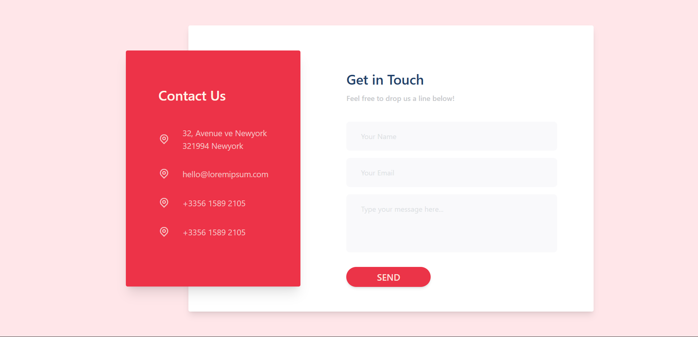
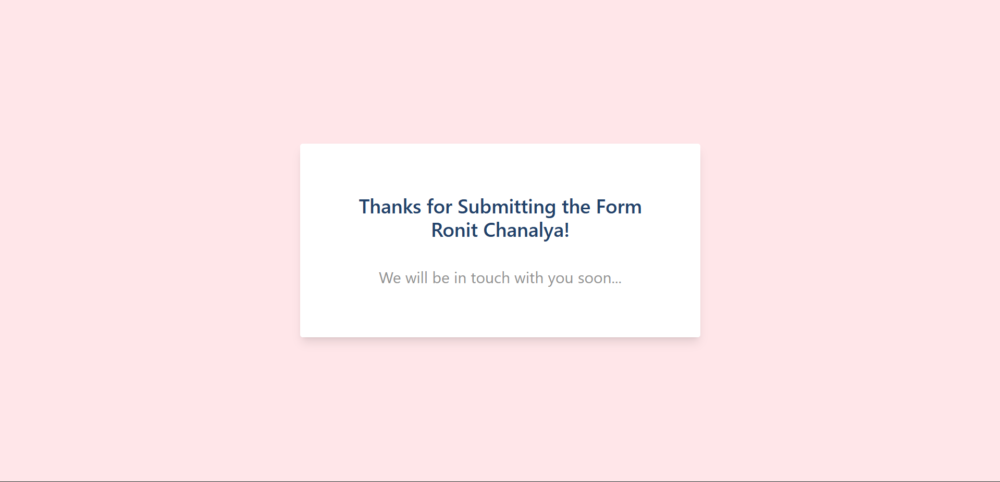

# 📬 Contact Form using React Context API

A clean and modern **Contact Us** page built with **React + Context API + TailwindCSS**.  
The form collects **Name, Email, Message** and stores them globally using the **Context API**, avoiding prop-drilling and keeping your components clean.

<p align="center">
  
</p>
<p align="center">
  
</p>

---

## 🚀 Features

✅ Global state management using **React Context API**  
📦 Centralized form data store  
🎨 TailwindCSS UI  
🔄 Real-time state sharing across components  
♻️ Form auto-resets on submit  
🧠 Beginner-friendly React state architecture  

---

## 🧠 How It Works (Flow)

1️⃣ User fills the form  
2️⃣ Form updates global context state  
3️⃣ Any component can access submitted data  

---

## 📂 Folder Structure
```
src/
├─ components/
│ ├─ Context/
│ │ └─ FormContext.jsx
│ └─ pages/
│ ├─ ContactUs.jsx
│ └─ Form.jsx
│ └─ GetInTouch.jsx
│ └─ Response.jsx
├─ App.jsx
├─ main.jsx
└─ index.css
```

## ▶️ Run Locally
```
npm install
npm run dev
```

### 🎨 UI link: https://in.pinterest.com/pin/12384967722126289/